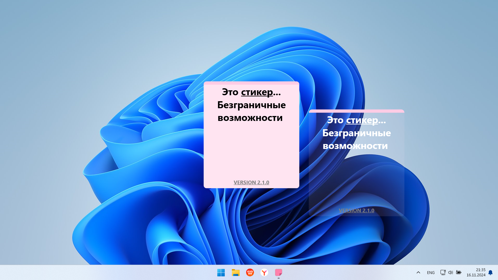
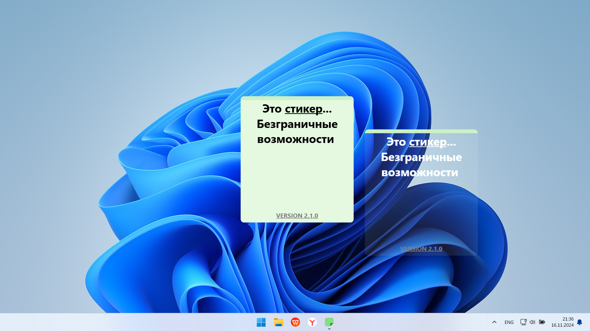
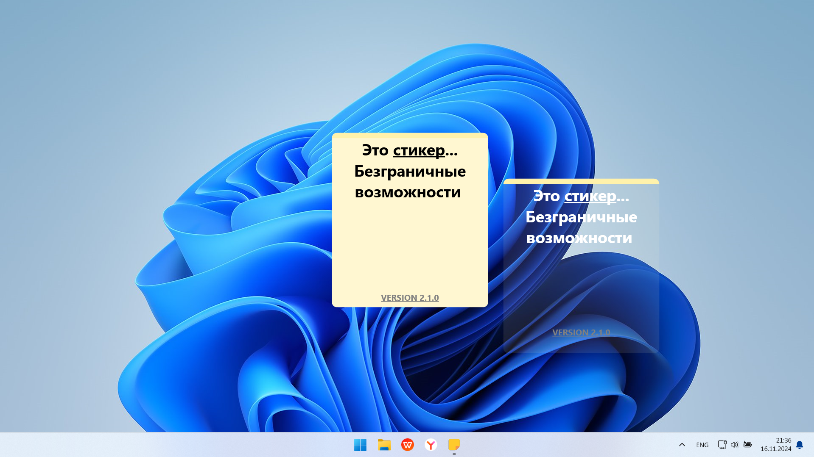
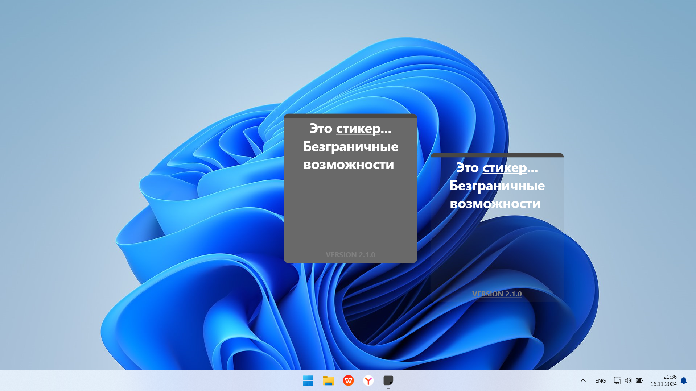

# 📝 StickyNotes
###### StickyNotes - это приложение для создания и редактирования стикеров, которые можно закрепить на рабочем столе, чтобы всегда держать важную информацию или список дел под рукой. С помощью этого приложения вы можете легко добавлять текстовые стикеры, настраивать их внешний вид, а также изменять различные параметры, такие как размер, прозрачность и цвет.

## 🎨 Основные возможности

- **Создание стикеров**: Легко добавляйте стикеры прямо на рабочий стол.

- **Редактирование текста**: Возможность редактировать текст на стикере, включая:
  - Изменение шрифта (жирный, курсив, подчеркивание, зачеркнутый).
  - Вставка любого текста на стикер.
  - Вставка любого изображения на стикер.
  - Выбор цвета текста
  - Изменение размера шрифта
  - 
- **Цветовые темы стикеров**: Стикеры могут быть окрашены в один из 7 доступных цветов.

- **Изменение размера**: Регулировка размеров стикера для удобного размещения на экране.
    
- **Прозрачность**: Возможность сделать стикер полупрозрачным или полностью прозрачным, что позволяет вам настроить внешний вид на ваше усмотрение.
    
- **Перемещение стикеров**: Легко перетаскивайте стикеры по рабочему столу для удобства использования.
    
- **Минимизация стикера**: Если стикер не нужен на экране в данный момент, можно его свернуть или скрыть, чтобы освободить место.

## 🔒 Безопасность
StickyNotes предоставляет мощные инструменты для защиты вашей информации:

- 🛡️ **Парольная защита**: 
  - Вы можете установить пароль на каждый стикер, чтобы защитить его содержимое.
  - Пароль предотвращает несанкционированное редактирование или просмотр текста и изображений на стикере.
  - Удобное окно для ввода пароля появляется при попытке открыть защищенный стикер.

- 🔐 **Блокировка стикеров при блокировке Windows**: 
  - Когда компьютер переходит в режим блокировки (например, через Win + L), все стикеры автоматически скрываются.
  - Это гарантирует, что ваши данные останутся конфиденциальными, даже если кто-то получит доступ к вашему рабочему столу.

## 🖍️Цвета стикеров

<table>
  <tr>
    <td>Фиолетовый</td>
    <td>Розовый</td>
    <td>Зеленый</td>
  </tr>
  <tr>
    <td></td>
    <td></td>
    <td></td>
  </tr>
  <tr>
    <td>Синий</td>
    <td>Желтый</td>
    <td>Черный</td>
  </tr>
  <tr>
    <td></td>
    <td></td>
    <td></td>
  </tr>
  <tr>
    <td>Серый</td>
    <td></td>
    <td></td>
  </tr>
  <tr>
    <td></td>
    <td></td>
    <td></td>
  </tr>
</table>

## Дополнительные возможности StickyNotes

### 🖼️ Адаптивные фотографии на стикерах
- **Добавление изображений**: Стикеры поддерживают возможность добавлять фотографии, что позволяет визуализировать задачи или добавлять важные визуальные напоминания.
- **Адаптивный размер**: Изображения автоматически изменяют размер, подстраиваясь под размеры стикера. Это гарантирует, что фотографии всегда выглядят аккуратно и пропорционально.
- **Практические применения**:
  - Добавляйте фотографии схем, диаграмм, записок, чеков или даже любимых мемов для повышения мотивации.
  - Используйте изображения для визуальных списков, например, планов по ремонту или вдохновляющих идей.

### 🔧 Простое управление
- В нижней части стикера размещены удобные кнопки для работы с текстом, включая возможность добавить фотографию.

### 📌 Удобство и персонализация
StickyNotes адаптируется под разные сценарии использования, предоставляя удобный и настраиваемый интерфейс:

- Быстрый доступ к функциям:
  - Панель инструментов на каждом стикере позволяет редактировать текст, изменять цвет, добавлять фотографии и настраивать прозрачность.
  - Простое удаление стикеров без лишних шагов.
  - 
- Персонализация стикеров:
  - Комбинируйте текст и изображения, чтобы создать идеальный напоминатель.
  - Каждый стикер может быть настроен индивидуально, включая его цвет, прозрачность, размер и содержимое.
- Сохранение настроек:
  - Программа автоматически сохраняет все изменения, чтобы стикеры оставались такими же, как вы их оставили после перезагрузки приложения или системы.

## ⌨️ Горячие клавиши StickyNotes

Основные горячие клавиши StickyNotes

| ⌨️ Горячая клавиша   | ✨ Действие                        |
|----------------------|-----------------------------------|
| **Ctrl + A**         | Создать новый стикер              |
| **Ctrl + L**         | Блокировка стикера                |
| **Ctrl + B**         | Сделать выделенный текст жирным   |
| **Ctrl + I**         | Сделать выделенный текст курсивом |
| **Ctrl + U**         | Подчеркнуть выделенный текст      |
| **Ctrl + S**         | Зачеркнуть выделенный текст       |
| **Ctrl + T**         | Закрепить стикер                  |
| **Ctrl + N**         | Переименовать стикер              |
| **Ctrl + Alt + ]/[** | Изменить прозрачность стикера     |
| **Ctrl + Shift + B** | Сохранить текущие изменения       |
| **Ctrl + S**         | Сохранить текущие изменения       |
| **Ctrl + X**         | Изменения цвета стикера           |

Всего их: 32 штуки

## 📥 Установка

1) Скачайте последнюю версию StickyNotes с репозитория.
2) Распакуйте архив в удобное место на вашем компьютере.
3) Запустите программу, следуя инструкциям на экране.

## 🛠️ Системные требования 

- 📱**Операционная система**: Windows (не ниже 10 версии)
- ⚡ **Процессор**: 1 GHz или быстрее.
- 📱 **Оперативная память**: минимум 200 MB. 
- 🚀 Доступ к интернету для загрузки обновлений (опционально).

**StickyNotes** — ваш идеальный помощник для организации рабочего пространства с удобными стикерами на рабочем столе!